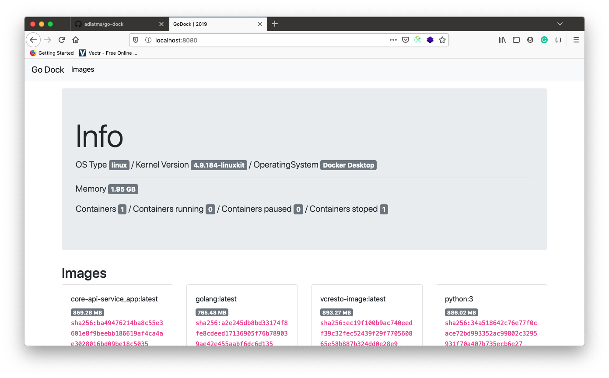

# Go Dock

Manage your docker images and container with GoDock.

## Features

- [x] Show docker images
- [ ] Search docker images
- [x] Show disk usage
- [x] Show Info

## How to start?

- Copy `.env.example` to `.env`
- Just `go run main.go` to running server.

## License

MIT
